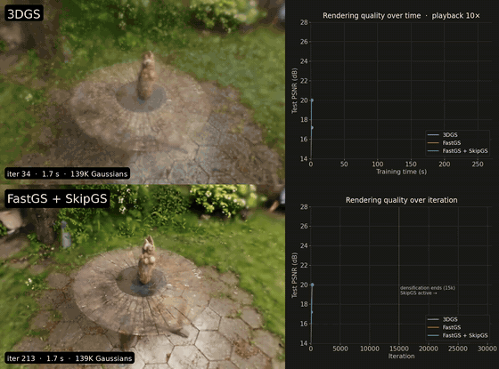
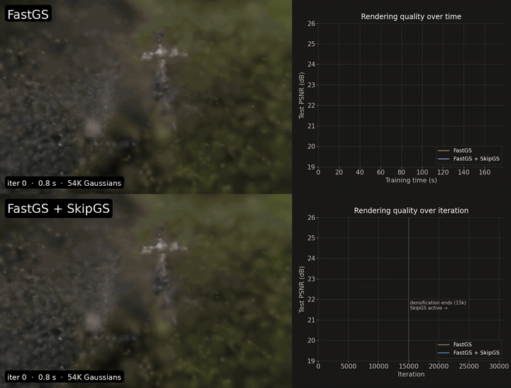
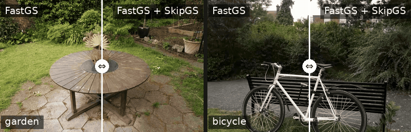
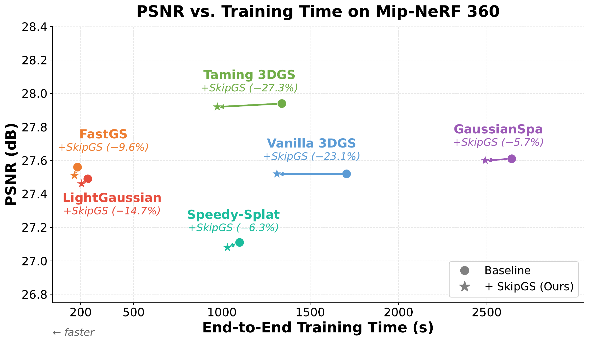
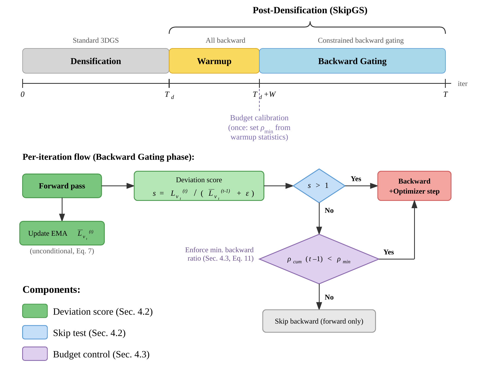

<div align="center">

# SkipGS: Post-Densification Backward Skipping for Efficient 3DGS Training

### ECCV 2026

Jingxing Li, Yongjae Lee, and Deliang Fan

Arizona State University

[](https://arxiv.org/abs/2603.08997)
[](LICENSE)

</div>

## Training process visualization

<div align="center">





</div>

Same scene trained three times from scratch (0 → 30k) on identical GPUs —
original 3DGS, FastGS, and FastGS + SkipGS — with a held-out view rendered as
training runs and test PSNR plotted against training time and iteration.
Playback is 10× until both FastGS runs finish, then 80× for the rest of the
3DGS run (the current speed is shown in the plot title). SkipGS acts only after
densification ends (15k), so the two FastGS runs are identical until then and
SkipGS finishes first. Deltas are relative to 3DGS; all three use the same
1600-px images and test split (FastGS's protocol).

| Scene | Method | Training time | Post-densification time | Test PSNR | Gaussians |
|-------|--------|--------------:|------------------------:|----------:|----------:|
| garden | 3DGS | 2739.4 s | 1328.1 s | 27.40 | 4.20M |
|  | + FastGS | 236.7 s (-91%) | 116.9 s (-91%) | 27.24 (-0.15) | 736K |
|  | + SkipGS | 199.0 s (-93%) | 83.0 s (-94%) | 27.20 (-0.20) | 746K |
| bicycle | 3DGS | 2781.9 s | 1470.8 s | 25.15 | 4.76M |
|  | + FastGS | 173.8 s (-94%) | 88.8 s (-94%) | 24.85 (-0.30) | 541K |
|  | + SkipGS | 154.2 s (-94%) | 68.7 s (-95%) | 24.83 (-0.32) | 535K |

**Tour over the optimized scenes.** The two finished models rendered along the
same camera orbit; the divider sweeps between FastGS (left) and FastGS + SkipGS
(right). **[Drag it yourself on the interactive demo page →](https://raw.githack.com/ASU-ESIC-FAN-Lab/SkipGS/gh-pages/index.html)**

<div align="center">



</div>

SkipGS skips the backward pass on 3DGS training views that have already
converged. After densification ends, the backward pass dominates iteration
cost (~62%), yet many sampled views have near-plateaued losses and contribute
weakly informative gradients. SkipGS keeps the forward pass (to track per-view
loss statistics) and selectively skips backpropagation when the sampled view's
loss is consistent with its recent per-view baseline, under a minimum backward
budget. On Mip-NeRF 360 it cuts end-to-end 3DGS training time by **23.1%**
(**42.0%** of post-densification time) at matched quality — and because it
only changes *when* to backpropagate, it plugs into other efficient 3DGS
pipelines (FastGS, Taming 3DGS, GaussianSpa, LightGaussian, Speedy-Splat) for
additive speedups.

<div align="center">



</div>

## How it works

<div align="center">



</div>

Per view, keep an EMA of the loss (updated every visit — the forward always
runs). Current loss at/below the EMA → nothing surprising → skip the backward
and optimizer step. A `warmup` window after densification seeds the EMAs and
calibrates a **minimum backward budget**: a floor on the fraction of real
backwards, enforced throughout, so skipping can never starve optimization.
No CUDA, no renderer or model changes, zero dependencies.

## Install

```bash
pip install -e .
```

## Use

Every 3DGS trainer — vanilla, gsplat, FastGS, Taming, your fork — has the same
core loop. SkipGS is one added line in it:

```python
from skipgs import SkipController

skip = SkipController(start_iter=15000)              # = your densify_until_iter

for iteration in range(1, 30001):
    cam = pick_training_view()
    loss = compute_loss(render(cam), gt)             # forward always runs
    if skip(cam.uid, loss.item(), iteration):        # ← the added line
        continue                                     # converged view: no backward, no step
    loss.backward()
    densification_hooks(...)                         # unchanged — SkipGS never skips
    optimizer.step()                                 #   before start_iter, so these
    optimizer.zero_grad(set_to_none=True)            #   always have their gradients

print(skip.summary())
# → {'total_bwd': 10433, 'total_skip': 4567, 'total_iter_post': 15000,
#    'bwd_ratio': 0.696, 'skip_ratio': 0.304, 'min_bwd_ratio_final': 0.696}
#   (a real run: vanilla 3DGS on Mip-NeRF 360 "counter", resumed 15k → 30k)
```

Porting to your trainer means making the same three decisions:

1. **What is `start_iter`?** Wherever your trainer stops densifying/refining —
   `densify_until_iter` in Inria-style trainers, `strategy.refine_stop_iter` in
   gsplat. Before it, SkipGS does nothing, so the densification path needs zero changes.
2. **What is a `view_id`?** Anything hashable that names the training view: camera
   uid, image filename. Batch trainer with one joint loss? Pass a constant id — the
   policy falls back to one global loss EMA and still works.
3. **What happens on a skip?** Everything gradient-related sits out this iteration:
   the backward, *every* optimizer's `step()`/`zero_grad()` (some trainers have
   several), any hook that reads `.grad`. LR schedulers keep running as normal.

Worked examples (validated on real training runs):
[gaussian-splatting](examples/integrate_gaussian_splatting.md) ·
[FastGS](examples/integrate_fastgs.md) ·
[gsplat](examples/integrate_gsplat.md) ·
[Taming 3DGS](examples/integrate_taming_3dgs.md) ·
[Speedy-Splat](examples/integrate_speedy_splat.md) ·
[LightGaussian](examples/integrate_lightgaussian.md) ·
[GaussianSpa](examples/integrate_gaussianspa.md).

## API

| Param | Default | |
|-------|---------|---|
| `start_iter` | — | skipping starts here |
| `threshold` | `0.0` | >0 also skips slightly-above-average views |
| `ema_decay` | `0.95` | per-view loss EMA |
| `warmup` | `500` | no skipping, calibration only |
| `min_bwd_ratio` | `"auto"` | backward floor; float to set, `0.0` to disable |
| `enabled` | `True` | `False` = inert, for baseline runs |

Set when you need it:

- `skip.state_dict()` / `load_state_dict()` — checkpointing
- `should_skip()` + `record()` — two-call form, if you sometimes override the decision
  (`skip(...)` is short for `skip.decide(...)`, which does both at once)
- `decide_batch(ids, losses, it)` — separable per-view losses in a batch
- `step_mode="adaptive_norm"` — experimental, also spaces out optimizer steps:
  gradients accumulate until they carry more signal than noise, then one step fires
  (parameter-free; `step_trigger="ref_k"` for a fixed target instead). Gate the step
  on `skip.after_backward(params, it)` — it returns True on every iteration in the
  default mode, so the loop needs no other change
- `observe_visibility(mask)` / `window_visibility()` — for sparse/selective Adam:
  keeps the union of visibility masks over an accumulation window

## Citation

If you find SkipGS useful, please cite:

```bibtex
@misc{li2026skipgspostdensificationbackwardskipping,
      title={SkipGS: Post-Densification Backward Skipping for Efficient 3DGS Training},
      author={Jingxing Li and Yongjae Lee and Deliang Fan},
      year={2026},
      eprint={2603.08997},
      archivePrefix={arXiv},
      primaryClass={cs.CV},
      url={https://arxiv.org/abs/2603.08997},
}
```

## License

MIT — see [LICENSE](LICENSE).
